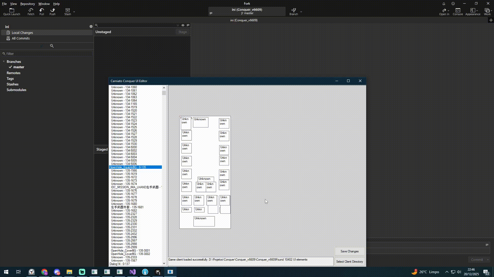

# Carniato Conquer UI Editor

Visual interface editor for Conquer Online game clients.

This project allows you to edit `GUI.ini` files from Conquer clients visually, moving interface elements directly on screen and saving changes automatically.

## What does it do?

- Loads and visualizes UI elements from Conquer clients
- Allows moving interface elements by dragging with the mouse
- Automatically saves X and Y coordinates to `GUI.ini` files

## How to Use

1. Run the program
2. Click "Select Client Directory"
3. Select the Conquer client root folder
4. Select an element from the list to view it in the panel
5. Drag elements to reposition them
6. Click "Save" to save changes to the `GUI.ini` file

## Requirements

- Windows
- .NET Framework 4.7.2 or higher

## Credits

Original project developed by **kennylovecode** and shared with the community.

This project is a continuation/update of the original work, with improvements and translations.

## Contributions

Contributions are welcome! Feel free to open issues, suggest improvements, or submit pull requests.

---

⭐ If you liked the project, leave a star! ⭐

